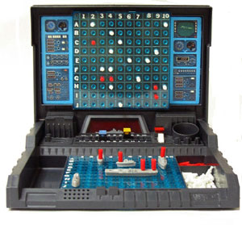
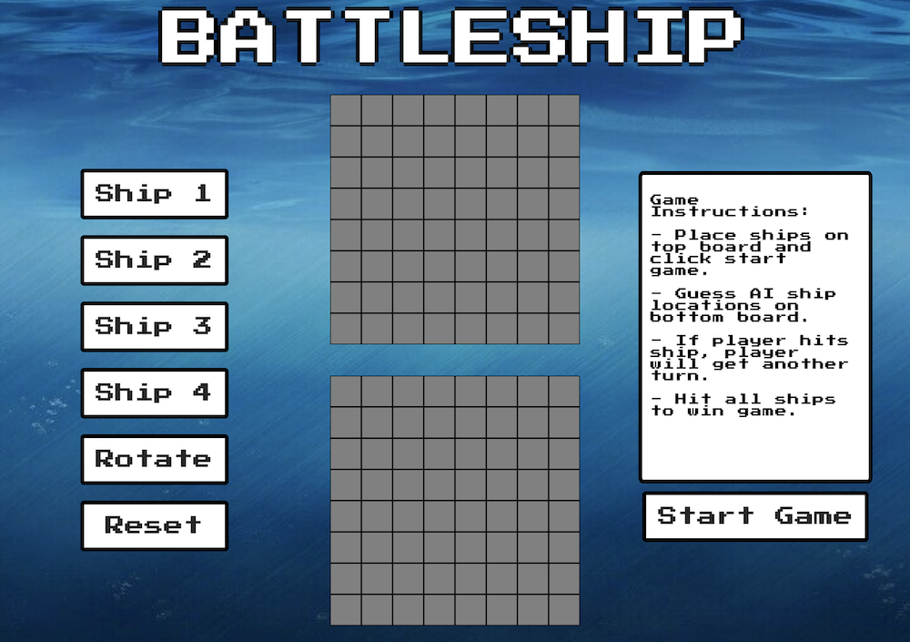
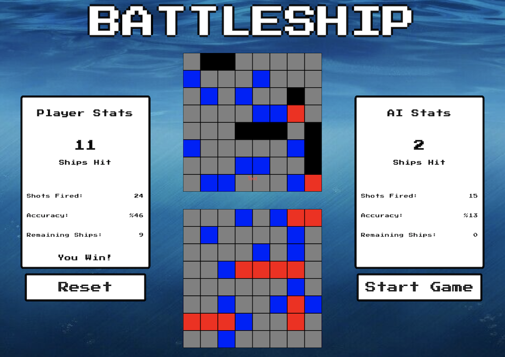

# Battleship

Battleship is a 2 player strategy game. Each player places ships on a grid. The goal of the game is to guess where the other player's ships are placed. When player makes a correct guess, they will get another turn to guess again. Turn switches when guess is wrong. The first player to sink all of the other player's ships wins the game.

# Screenshots:

 

# Technologies Used
* HTML
* CSS
* Javascript

# Getting Started

* Player places ships on top board.
* Bottom board will be used to guess AI ships.
* Grid colors:
* Grey - Space not played yet
* Blue - Shot missed(hit the water)
* Red - Ship hit
* First to sink all ships wins the game.

[Click here to play!](https://alynguyen.github.io/battle-ship/)

# Next Steps
* Display ship graphics instead of grid.
* Add hard mode setting for AI to make smarter moves.
* Sizable for mobile.